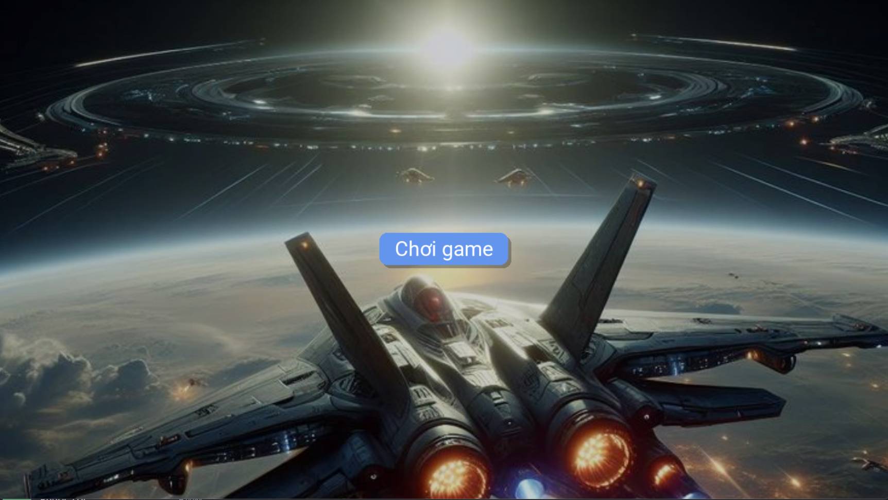

<div align=center margin= auto> 
  
</div>

# 👽 Alien Invasion

## 🚀 Giới Thiệu
> - Tên đề tài: Xây dựng game Alien Invasion bằng Python sử dụng thư viện pygame
> - Mục tiêu: Xây dựng một game đơn giản dạng bắn súng không gian, trong đó người chơi điều khiển một con tàu vũ trụ để tiêu diệt các alien xâm lược.

## 🔧 Yêu cầu
- [Python](https://www.python.org/) 3.x +
- [Pygame](https://www.pygame.org/)

## :video_game: Điều khiển

- Phím Space
  - Chức năng: tấn công

- Phím mũi tên (trái / phải)
  - Dùng để di chuyển qua lại

## Tải game

```
$ git clone https://github.com/Yairoo04/gameAlien.git
```

## Chạy game

```
$ cd Alien-Invasion

$ python alien_invasion.py
``` 
